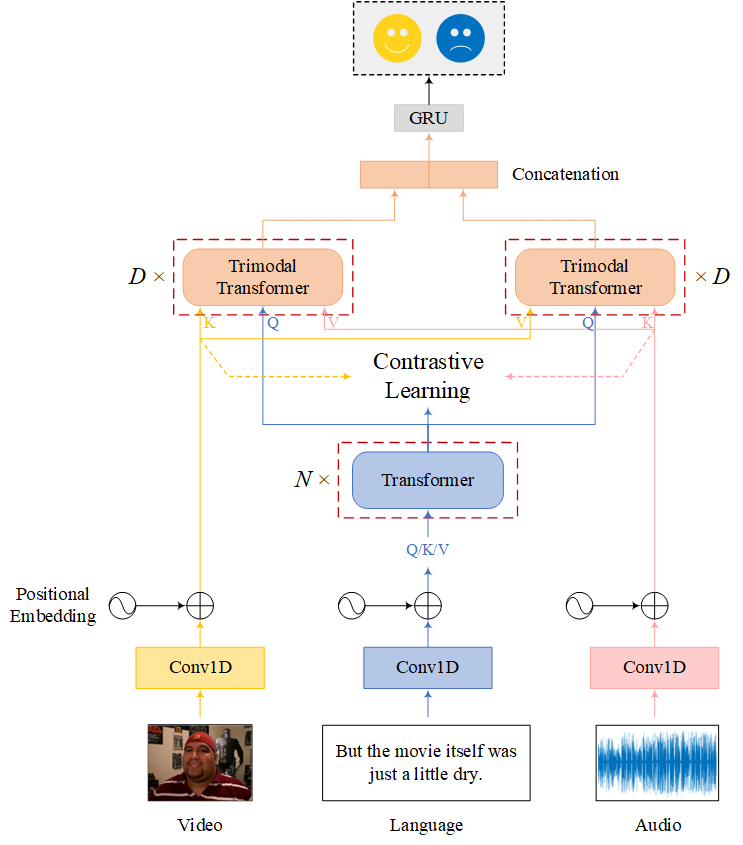

# TriSAT

## Introduction
**Tri**modal representations for **S**entiment **A**nalysis from **T**ransformers(**TriSAT**)

## Requirements
- Python 3.8
- Pytorch 1.7.1
- CUDA 10.1

## Overview architecture for TriSAT
\
TriSAT fuses three modalities at a time through the attention mechanism and uses ar loss and tsc loss to assist in sentiment analysis.\
The core of our model is the trimodal transformer module (```multimodal_transformer.py```),\
And the ar, tsc loss modules (```losses.py```).\
The entire TriSAT framework is in ```models_transformer.py```.

## Usage

### Dataset
processed MOSI, MOSEI and IEMOCAP can be downloaded from:
http://immortal.multicomp.cs.cmu.edu/raw_datasets/processed_data/

### Run the code
~~~~
python main_[DatasetName].py [--FLAGS]
~~~~